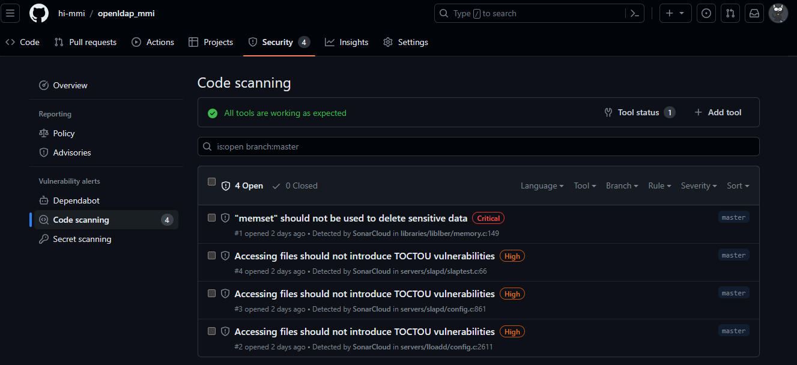
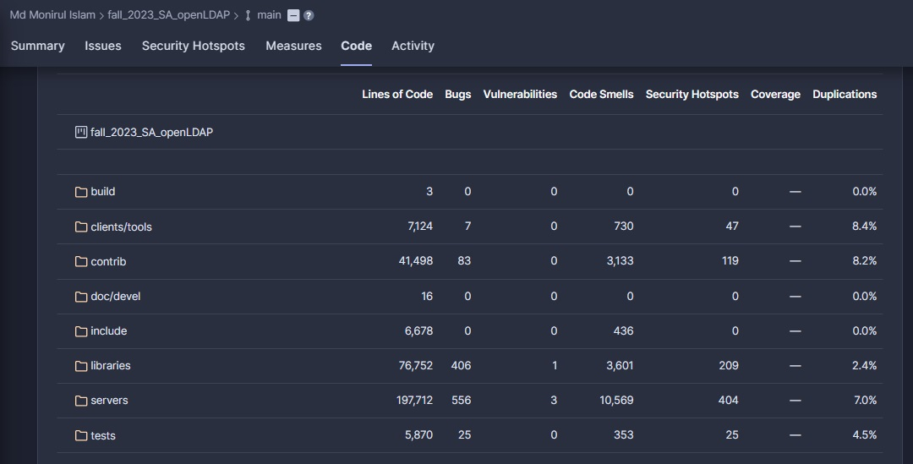

# Part 1: Code Review

**CWE Checklist**

| Serial   | CWE |  Type | Name |
|:------------|:---------- | :----------| :---------- |
|1| CWE-121 | Varient | Stack-based Buffer Overflow |
|2| CWE-122 | Varient | Heap-based Buffer Overflow |
|3| CWE-124 | Base | Buffer Underwrite ('Buffer Underflow') |
|4| CWE-134 | Base | Use of Externally-Controlled Format String |
|5| CWE-192 | Varient | Integer Coercion Error |
|6| CWE-197 | Base | Numeric Truncation Error |
|7| CWE-364 | Base | Signal Handler Race Condition |
|8| CWE-704 | Class | Incorrect Type Conversion or Cast |
|9| CWE-789 | Varient | Memory Allocation with Excessive Size Value |


**Code Review Tool Selection**

We ran the code through the GitHub code scanning which found [14 vulnerabilities](https://github.com/bartelsjoshuac/openldap/security/code-scanning), all critical or high. Given the small number the fact that 9 of the 14 fall into the category of "Multiplication result converted to larger type".  This really just gives us 5 to look at, albeit 9 of them are in different places to examine they are all in the same mdb.c library file, which is the SleepyCat (Berkley DB back end).

We then selected SonarCloud as another automated code scanning tool to validate the findings of our first pass.
We wanted to use another automated scanning tool to validate our findings from GitHub CodeQL Workflow. To achieve this, we utilized SonarCloud. SonarCloud is a commercial tool with a powerful set of language-specific analyzers that use thousands of rules to track down hard-to-find issues. As proud supporters of the open source community, SonarCloud allows free usage if this tool for open source projects. This tool yielded vulnerability findings as our initial tool, thus verifying our initial results.

**What challenges did you expect before starting the code review?**

No members of the team are fluent in vanilla C programming, although most intermediately familiar with C from university courses. Fortunately, automated tools do not require in depth familiaty with the landuage as they find common flaws in common syntax.

First, we did not anticipate finding the number of repeated errors that we did in such a mature product. This implies that there may be a pervasive architectural fault or a false-positive in the automated code review tool.

Second, we were unsure how much our inherant subjectivity would impact our collective understanding of the codebase. Code reviews can be subjective, with different reviewers having varying opinions on what constitutes “good code”. With this in mind, we must consider that subjectivity can lead to disagreements and inconsistencies in code review standards.

Finally, we were unsure how the sturcture of an open-source codebase would impact the code quality. Open-source projects have a tendancy to vary greatly in their code qualities. We anticipated that this may lead to significant inconsistency in portions of the code due to the unstructured nature of open-source projects.

*How did your code review strategy attempt to address the anticipated challenges?*

The github code review categorizes vulnerabilities by easily researchable strings

***

*Document findings from a manual code review of critical security functions identified in misuse cases, assurance cases, and threat models.*


| Serial   | Alert    | Severity    | CWE |
|:------------|:----------|:------------:|:-----------:|
|1| Uncontrolled format string | Critical | [CWE-134: Use of Externally-Controlled Format String ](https://cwe.mitre.org/data/definitions/134.html) |
|2| Multiplication result converted to larger type | High | (CWE-190: Integer Overflow or Wraparound)[https://cwe.mitre.org/data/definitions/190.html]
|3| Multiplication result converted to larger type | High | (CWE-192: Integer Coercion Error)[https://cwe.mitre.org/data/definitions/192.html]
|4| Multiplication result converted to larger type | High | (CWE-197: Numeric Truncation Error)[https://cwe.mitre.org/data/definitions/197.html]
|5| Multiplication result converted to larger type | High |  (CWE-681: Incorrect Conversion between Numeric Types) [https://cwe.mitre.org/data/definitions/681.html]

Looking at the uncontrolled format string found in ldapsearch.c (CWE-134)  This is actually the ldapsearch command line utility that is include with OpenLDAP.  This may be used be an admin, with root privledges to SSH to the server only, and is not commonly used, except for tests.
  ```
  } else
    {
  first = 0;
  }
  rc1 = dosearch( ld, base, scope, filtpattern, line,
 ```

The value of this argument may come from  and is being used as a formatting argument to dosearch(filtpatt), which calls snprintf(__fmt).
The value of this argument may come from  and is being used as a formatting argument to dosearch(filtpatt), which calls snprintf(__fmt), which calls __builtin___snprintf_chk((unnamed parameter 4)).
CodeQL
```
    attrs, attrsonly, NULL, NULL, NULL, sizelimit );

  if ( rc1 != 0 ) {
```

One of the arguments to the ldapsearch command is a search filter.  Here is a valid filter that  (&(uid=josh*)(objectClass=interOrgPerson)(!(l=Omaha))).  This would give us all uid objects of the objectClass inetOrgPerson where the userstart starts with josh and the city is NOT Omaha.  If the search filter were formatted incorrectly, the ldapsearch utility would print this to the screen and the !l would be interpreted by the shell.  If that letter l was a number, the shell could execute that command from the history of the user executing the ldapsearch.

One option would be to escape the output however since the desire in this use case is to inform the user that they entered an invalid search filter, padding it with escape chars might confuse them further.

The 9 common vulnerabilities of the type "Multiplication result converted to larger type". In most cases a multiplication of two values is occuring before prior to a type conversation to a larger type.  THis encompass 4 CWE's (190, 192, 197, and 681)

Multiplication result may overflow 'unsigned int' before it is converted to 'size_t'. (NOTE: These were all later update by GitHub  later updated to read "Multiplication result converted to larger type")

```
  return rc;
  /* Make cursor pages writable */
  buf = ptr = malloc(my->mc_env->me_psize * mc.mc_snum);
```
Multiplication result may overflow 'unsigned int' before it is converted to 'size_t'.
```
  if (buf == NULL)
	  	return ENOMEM;
```

A 64 bit unsigned int has a max value of 18,446,744,073,709,551,615.  I suppose a checked could be included to insure that it does not exceed that value however the number is so large the author likely assumeed it be to impossible.  Since there are 9 locations where this same type of operation is done and not checked, I assume skipping this was intentional.

***

*Document findings from automated code scanning (if available). Include links to tool outputs.*

Utilizing [SonarCloud](https://sonarcloud.io/), we've conducted an analysis of the openLDAP project to assess the quality of its code. The insights obtained from SonarCloud have been pivotal in identifying critical areas of concern. There were 4 vulnerabilities reported by SonarCloud.

SonarCloud scan result: [link](https://sonarcloud.io/summary/overall?id=hi-mmi_openldap_mmi)



Following table illustrates vulnerabilities and corresponding CWE ID. In our findings, a critical vulnerability was pinpointed in the usage of "memset" for deleting sensitive data, a practice susceptible to compiler optimization that could lead to security flaws, as per CWE-14. Additionally, three high-severity vulnerabilities related to TOCTOU race conditions (CWE-367) were discovered, suggesting potential security risks during file access operations.

| Serial   | Alert    | Severity    | CWE |
|:------------|:----------|:------------:|:-----------:|
|1| "memset" should not be used to delete sensitive data | Critical |[CWE-14: Compiler Removal of Code to Clear Buffers](https://cwe.mitre.org/data/definitions/14)|
|2|Accessing files should not introduce TOCTOU vulnerabilities | High |[CWE-367: Time-of-check Time-of-use (TOCTOU) Race Condition](https://cwe.mitre.org/data/definitions/367)|
|3| Accessing files should not introduce TOCTOU vulnerabilities | High |[CWE-367: Time-of-check Time-of-use (TOCTOU) Race Condition](https://cwe.mitre.org/data/definitions/367)|
|4| Accessing files should not introduce TOCTOU vulnerabilities | High |[CWE-367: Time-of-check Time-of-use (TOCTOU) Race Condition](https://cwe.mitre.org/data/definitions/367)|


The analysis also revealed a substantial count of bugs across the project's directories:
- `clients/tools`: 7 bugs
- `contrib`: 83 bugs
- `libraries`: 406 bugs, 1 vulnerability
- `servers`: 556 bugs, 3 vulnerabilities
- `tests`: 25 bugs

Complete breakdown of the report is seen in the following image:




The Common Weakness Enumeration (CWE) provides a categorized listing of software weaknesses and technical vulnerabilities. By correlating these with the MITRE ATT&CK framework, which outlines the tactics and techniques used by adversaries, we can better anticipate potential threats. Furthermore, aligning these insights with the MITRE D3FEND framework allows us to establish proactive defenses. Below is a table that illustrates the relationship between common vulnerabilities, the corresponding one potential attack technique, and the countermeasures recommended by MITRE D3FEND.


| **CWE** | **MITRE ATT&CK Framework Technique** | **D3FEND Inferred Relationships** |
|---------|--------------------------------------|--------------------------------|
| CWE-14: Compiler Removal of Code to Clear Buffers | [T1055: Process Injection](https://attack.mitre.org/techniques/T1055/) - Exploits lingering sensitive data in memory due to incomplete buffer clearing, allowing the injection of malicious code into processes. | [File and Directory Permissions Modification - T1222](https://d3fend.mitre.org/offensive-technique/attack/T1055/) |
| CWE-367: Time-of-check Time-of-use (TOCTOU) Race Condition | [T1222: File and Directory Permissions Modification](https://attack.mitre.org/techniques/T1222/) - Leverages TOCTOU race conditions to alter file or directory permissions, potentially leading to unauthorized access or privilege escalation. | [Process Injection - T1055](https://d3fend.mitre.org/offensive-technique/attack/T1222/) |

The table above serves as a strategic guide to understanding the nexus between vulnerabilities, attack methodologies, and defensive tactics. It emphasizes how crucial it is to stay ahead of potential threats by not only being aware of how systems can be compromised but also by implementing the appropriate countermeasures.
# Part 2: Key Findings and Contributions

*Provide a summary of findings from manual and/or automated scanning. This summary should include mappings to CWEs to describe significant findings and perceive risk in your hypothetical operational environment.*

We can see significant difference in what GitHub's codeQL found and SonarCloud, in fact none of the same vulnerabilities are flagged.

*Describe your planned or ongoing contributions to the upstream open-source project (I.documentation, design changes, code changes, communications, etc.). Your response can be based on any of the prior assignments in the class.*

*Include a link to your team's GitHub repository that shows your internal project task assignments and collaborations to finish this task.*

[Our GitHub OpenLDAP Fork](https://github.com/bartelsjoshuac/openldap)

[Github Code Scan](https://github.com/bartelsjoshuac/openldap/security/code-scanning) (requires project permissions)

[SonarCloud Scan](https://sonarcloud.io/summary/overall?id=hi-mmi_openldap_mmi)

[Project Board](https://github.com/users/bartelsjoshuac/projects/2/views/1)

[OpenLDAP CVE List](https://www.cvedetails.com/vulnerability-list/vendor_id-439/Openldap.html)


*Include a reflection of your teamwork for this assignment. What issues occurred? How did you resolve them? What did you plan to change moving forward?*

This assignment, like the Assurance Cases, reflects the work of just some of the team members as some team members have elected to not contribute, communicate or attend required meetings due to unknown circumstances.
